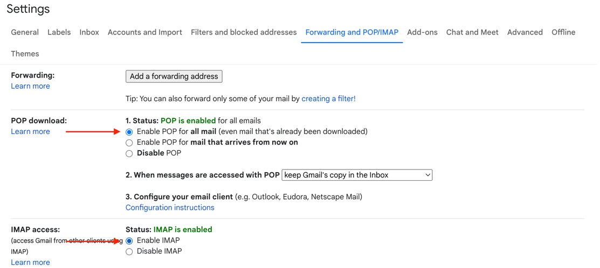
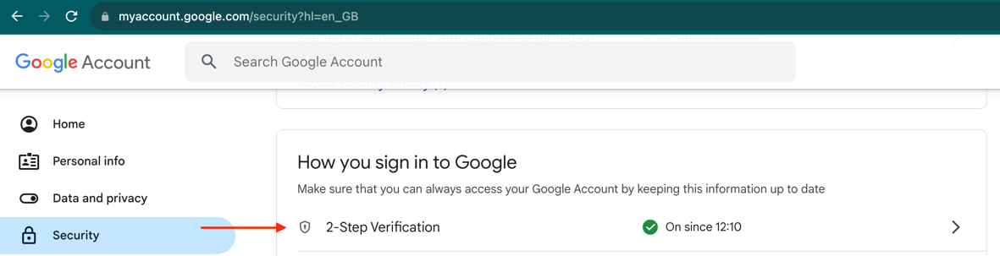
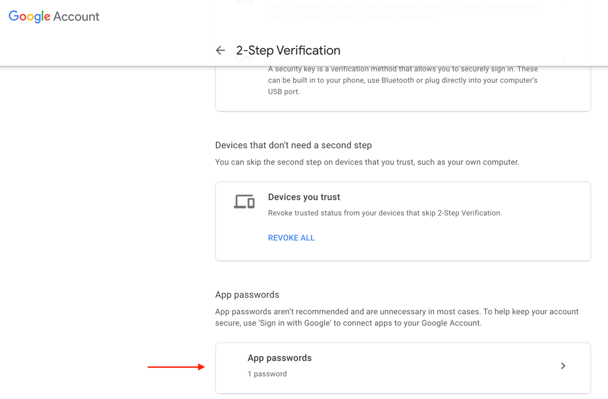
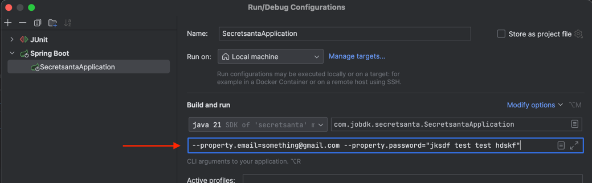

# Simple Secret Santa Application


## Overview
This repository contains a straightforward Secret Santa application to automate the process of assigning gift recipients and sending emails. Follow these steps to set up and utilize the application seamlessly.
## Setup

1. **Clone the repository:** Begin by cloning this repository to your local environment.
2. **Mail Account Setup:**
   -  The application utilizes Gmail for sending emails. To configure this:
     1.  **Enable POP and IMAP:** Access your Gmail account settings and activate POP and IMAP. <br> 
     2.  **Activate Two-Step Verification:** Enable this security feature for your Gmail account. <br> 
     3. **Create an App Password:** Generate a specific password for the application. Save this password securely. 
3. **Add Runtime Arguments:**
   - Configure the application with your email and the generated app password:
    1. Navigate to `Run -> Edit Configurations -> SecretSantaApplication
    2. Add the following arguments in the designated field::
       ```BASH
       --property.email=youremail --property.password="password from before"
       ```
       

## Usage

1. Run the application
2. Send POST request e.g. with postman

   **URL:** http://localhost:8080/api/v1/sendsecretsantas

   **Example Body:**
      ```JSON
      [
          {
              "name": "John",
              "email": "email1"
          },
          {
              "name": "Jane",
              "email": "email1"
          },
          {
              "name": "Jim",
              "email": "email1"
          }
      ]
   ```
2. Verify that the emails were sent but **make sure not to spoil the surprise!**